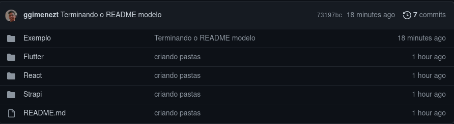
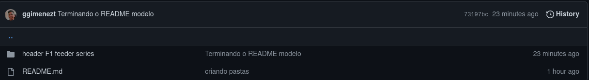

<h1 align="center">

</h1>

<h1 align="center">
HISTÓRICO DE REQUISITOS
</h1>

#  Indice 

- [Sobre](#-sobre)
- [Como encontrar um requisito](#-como-encontrar-um-requisito)
- [Como baixar um requisito](#-como-baixar-um-requisito)
- [Como adicionar um requisito](#-como-adicionar-um-requisito)
- [Dúvidas](#-dúvidas)

---

## ❓ Sobre
Bem vindos ao repositório de históricos de requisitos da byron 🥳

Aqui ficarão registrados todos os requisitos diferentes que foram implementados pelos desenvolvedores da byron durante a execução dos projetos, como aquele carousel mais difícil de colocar no site ou aquele login com redes sociais com tutorial só em hebraico.

Logo abaixo você encontrará explicações de como encontrar um requisito que está procurando, baixar esse requisito ou adicionar um requisito que você queira aqui no repositório.

Aproveitem e usem sem moderação 😁

---

## 🔎 Como encontrar um requisito

Para encontrar um requisito é muito simples, logo na página inicial você encontrará pastas com as tecnologias da utilizadas na byron:

Identifique a tecnologia referente ao requisito que deseja e lá teremos as pastas dos requisitos já registrados, a imagem a seguir mostra o requisito registrado na página de exemplo

Ao entrar na pasta da tecnologia, procure pelo requisito desejado, ao encontrar você pode entrar na pasta do mesmo e realizar o download 😀

Caso o requisito não esteja lá ele ainda não foi registrado e infelizmente você terá de procurar em outro lugar pela internet, mas depois de implementar não se esqueça de voltar aqui para registra-lo  💙

---

## 📁 Como baixar um requisito

---

## 📦 Como adicionar um requisito

---

## 🤔 Dúvidas
Qualquer dúvida contate um membro de DPJ :D

---